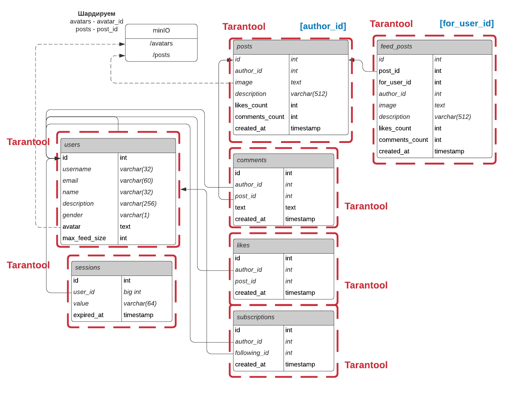

# 1. Выбор темы
Аналог Instagram, направленный на российскую аудиторию. MVP - личный профиль, подписки, лента, комментарии и лайки

# 2. Расчет нагрузки

## 2.1. Аудитория и ее активность

Месячная аудитория Instagram в России на 2021 год составляет 54 млн [(источник)](https://blog.hootsuite.com/instagram-demographics/)  
Дневная аудитория ~30 млн

На 2021 год в среднем, пользователь тратит 29 минут в день [(источник)](https://www.emarketer.com/content/emarketer-reduces-us-time-spent-estimates-for-facebook-and-snapchat)  
## 2.2. Собственные наблюдения
За 3 минуты просмотра ленты я успел просмотреть 30 постов, поставить 5 лайков и оставить один комментарий  

Будем предполагать, что средний пользователь добавляет 15 фотографий в свой профиль за месяц. Взаимодействует с подписками 10 раз в месяц  

## 2.3. Активность на пользователя
Пользователь в среднем заходит 15 раз в месяц [(источник)](https://popsters.ru/blog/post/svezhie-dannye-o-vk)

### Картинки
Картинки загружаются отдельными запросами на каждый пост. Причем на каждый пост приходится две картинки - аватар автора и сам пост.
```
60 GET / 3 min
```

### Post:
За один запрос на посты приходит 12 штук
```3 GET / 3 min``` Количество лайков, комментариев и сами первые три комментарии приходят вместе с запросом  
```15 POST / month``` Запрос на один пост занимает примерно 200кб (картинка) + 5 кб (другая информация)  

### Profile:
```1 GET / 3min``` Вместе с запросом на профиль приходит информация о подписках.  

Запрос на профиль занимает 40кб + первые посты ~740кб  

### Comment:
```
1 POST / 3 min.
5 GET / 3 min
```

Средняя длина комментариев в социальных сетях 200 символов (200b) [(источник)](https://habr.com/ru/post/72185/)  

### Subscriptions:
```
10 POST / month
```

### Likes:
```
5 POST / 3 min
```

## 2.4. Нагрузка от всей аудитории
Подитожим за сутки, учитывая, что пользователь тратит в сутки в среднем 29 мин:  

Пусть ```k = 30 000 000 users / (24 * 60 * 60) = 347,22 u/s``` - коэффициент, переводящий показатель requests per day для одного человека в rps для всей аудитории. 

### Получение картинок:
Средний вес картинки 200 Кб, аватарки - 4 Кб
```
60 * (29 min / 3 min) * k= 580 requests / day * k = 201 389 rps (19,59 Gb/s)
```

### Post
	GET: 3 * (29 min / 3 min) * k = 29 requests/day * k = 10 069 rps  (19,69 Gb/s)
	POST: 15 / 30 days * k = 0,5 requests/day * k = 174 rps (34,62 Mb/s)
### Profile
	GET: 1 * (29 min / 3 min) * k = 10 requests/day * k = 3 472 rps (32,78 Mb/s)

Прирост месячной аудитории в России за 2021 год согласно [источнику](https://blog.hootsuite.com/instagram-demographics/) составляет 3 млн пользователей.

Это значит, прирост пользователей в день ```3 million / 365 = 8219,14 users/day```  

Тогда rps на post profile будет ~ 1 rps  

### Comments:
За один запрос на комментарии приходит 12 комментариев. Один ответ весит в среднем 4 Kb (with gzip) -> 8kb (without gzip) -> avg comment response size = 8 / 12 = 0,67 Kb
```
GET 5 * 29 min / 3 min * k = 16 782 rps (65,56 Mb/s) (with gzip)
```
При расчете создания комментариев будем отталкиваться от статистики:
В среднем у постов 4 комментария [(источник)](https://blog.cybermarketing.ru/vovlechennost-instagram/)
Тогда средний rps POST комментариев будет равным ``174 * 4 = 696 rps (0,13 Mb/s)``
### Likes:
В среднем у постов 100 лайков [(источник)](https://blog.cybermarketing.ru/vovlechennost-instagram/)
```
POST 174 * 100 = 17 400 rps
```

### Subscriptions:
```
POST: 10 * 1 month / 30 days * k = 115 rps
```
Итого:
|Сущность|GET RPS|POST RPS|
|--------|-------|--------|
|Картинки|201 389|175|
|Post|10 069|174|
|Profile|3 472|1|
|Comment|16 782|696|
|Subscription|-|115|
|Like|-|17 400|
# 3. База данных
## 3.1. Логическая схема БД

## 3.2. Физическая схема
Схема с указанием шардирования изображений и количества серверов и их реплик

### 3.2.1. Фотографии
Все фотографии будем хранить в [minIO](https://min.io) по протоколу S3.
В качестве S3 будем использовать решение minio  
Картинки постов будут храниться по пути /posts/{post_id}.jpg
Аватарки - /avatars/{user_id}.jpg
#### Посты
При загрузке постов фотографии будут сжиматься до максимального размера ~700 Кб.  
Чаще всего встречающиеся размеры фотографий в Instagram: (720x1280, 1280x1350, 1080x1080, 720x720, 1080x695). Максимальный вес встретившейся фотографии - 623 кб. В среднем фотографии весят 200 кб  
Также будем хранить копию в размере 480x480 для отображения сетки профиля (/posts/{post_id}_preview.jpg). Примерный вес такого изображения - 40 кб

Ленту будем предгенерировать. При загрузке пользователем поста, его копии будут попадать ко всем его подписчикам в ленту.  
С учетом собственных наблюдений будем считать, что человек при активном пользовании может просмотреть 30 постов за 3 минуты. Тогда за день в среднем (при среднем времени использования приложения в 29 минут) человек просмотрит ``30 / 3 * 29 = 290`` постов. Тогда для каждого пользователя будем хранить его ленту размером в 290 постов. Так же будем понимать, насколько активно человек пользуется соц сетью, насколько часто он пролистывает до конца предгенерированной ленты и это число может как увеличиваться, так и уменьшаться
#### Аватарки
Аватарки будут храниться в размере 150x150. В среднем вес аватраки - 5 кб  
### 3.2.2. Выбор СУБД
Данные пользователей, посты и комментарии будем хранить в PostgreSQL, как в наиболее надежной и функциональной реляционной БД.  
Данные сессии, лайки и подписки будем хранить в Tarantool из-за его выскокой скорости работы 
### 3.2.3. Шардирование и репликация
|Сущность|Признак шардирования|
|--------|--------------------|
|posts|author_id|
|feed_posts|for_user_id|

Для обеспечения отказоустойчивости используем master-slave репликацию. По 2 реплики на каждый сервер. Мастер будет принимать запросы на запись, реплики - на чтение. При выходе из строя мастера, одна из реплик возмет на себя запросы на изменение. При выходе из строя всех реплик, запросы будут приходить только на мастер.
## 3.3. Размер данных
### Фотографии
Аватарки на всех пользователей
```
avatars = 54 000 000 * 5 KiB = 257,49 GiB
avatars_speed = 5 kb * 1 rps * 24h * 60m * 60s = 0,5 TiB/month
posts_speed = 240 kb * 174 rps * 24h * 60m * 60s = 3,36 TiB/day = 100,81 TiB/month
overall = 101,3 TiB/month
```
### Сессии
Учитываем активную дневную аудиторию, т.к. у пользователей которые долго не заходят сессии пропадают
```
(4b (id) + 4b (user_id) + 64b (value) + 4b (expired_at)) * 30 000 000 = 2,12 GiB
```
### Пользователи
Учитываем месячную аудиторию
```
(4b (id) + 32b (username) + 60b (email) + 32b (name) + 256b (description) + 1b (gender) + ~120b (avatar url)) * 54 000 000 000 = 25,4 Gb

1rps * 24 * 60 * 60 = 41,61 Mb/day = 1,22 Gb/month
```
### Посты
```
(4b (id) + 4b (author_id) + ~120b (image url) + 512b (description) + 4 (likes_count) + 4 (comments_count) + 4 (created_at)) * 174 rps * 24h * 60m * 60s = 9,13 Gb/day = 273,86 Gb/month
```
### Лента
```
(652b (post) + 4b (id) + 4b (for_user_id)) * 290 * 54 000 000 = 9,4 TiB
```
### Комментарии
В среднем у постов 4 комментария [(источник)](https://blog.cybermarketing.ru/vovlechennost-instagram/)
```
(4b (id) + 4b (author_id) + 4b (post_id) + 200b (text) * 4b (created_at)) * 4 * 174 rps * 24 * 60 * 60 = 12 Gb/day = 362,9 Gb/month
```
### Лайки
В среднем у поста 100 лайков [(источник)](https://blog.cybermarketing.ru/vovlechennost-instagram/)
```
(4b (id) + 4b (author_id) + 4b (post_id) + 4b (created_at)) * 100 * 174 * 24 * 60 * 60 = 22,402 GiB/day = 0,656 TiB/month
```
### Подписки
```
(4b (id) + 4b (author_id) + 4b (following_id) + 4b (created_at)) * 115 * 24 * 60 * 60 = 0,148 GiB/day = 4,442 GiB/month
```
|Сущность		|Размер						|
|---			|---						|
|Фотографии		|0,25 Tb + 101,3 TiB/month	|
|Сессии			|2,12 GiB					|
|Пользователи	|25,4GiB + 1,22 GiB/month	|
|Посты			|273,86 GiB/month			|
|Лента			|9,4 TiB					|
|Комментарии	|362,9 GiB/month			|
|Лайки			|0,656 TiB/month			|
|Подписки		|4,442 GiB/month			|
# 4. Схема проекта
Проект будем строить по микросервесной архитектуре, в силу простой масштабируемости отдельных компонентов системы.
Выделим следующие микросервисы:
1. API - сервис, который принимает запросы от клиента и решает, с какого сервиса какие данные запросить
2. Авторизация - сервис, который отвечает за авторизацию, понимание, авторизован ли пользователь (по кукам), и что это за пользоватеь
3. Профиль - отвечает за сбор регистрацию, получение страницы профиля
4. Посты - отвечает за ленту, посты пользователя
5. Подписки - создание, получение подписок, удаление подписки, счетчик общего количества подписок для пользователя
6. Комменты - создание, поллучение комментариев для поста
7. Лайки - создание, получение, удаление

К каждому микросервису прикреплена своя база данных (за исключением агрегирующего сервиса API)


## 4.1. Выбор технологий
### Backend
Микросервисы будем реализовывать на языке Golang в силу очень хорошего соотношения по производительность и легкости разработки. Так же будет очень кстати встроенная в язык работа с многопоточностью

### Client
Проект будет разрабатываться только под мобильные устройства. Для iOS будем разрабатывать на Swift, для Android - Kotlin.
# 5. Выбор оборудования
## 5.1. Расчет RPS на каждый микросервис
Пройдемся по каждому запросу и обозначим, как он будет происходить, какие сервисы затрагивать.
### Посты
1. Запрос на получение ленты (10 069 rps):
- API
- Auth - проверка авторизации, понимание, какой пользователь спрашивает
- Posts - получение постов из предгенерированной ленты feed_posts
- Comments - получение последних трех комментариев для постов
1. Создание поста (174 rps): 
- API
- Auth
- Posts - создание поста
- S3 - загрузка фотографии в хранилище
### Профиль
1. Получение профиля пользователя (3 472 rps):
- API
- Profile - получение основной информации пользователя (имя, логин, урл картинки, bio)
- Subscriptions - получение информации о подписках
- Posts - количество постов, получение первых в пагинации постов
- Comments
2. Создание профиля (1 rps):
- API
- Profile - создание пользователя
- Auth - выдача сессии
### Комментарии
1. Получение комментариев к посту (16 782 rps):
- API
- Comments - получение комментариев к посту
2. Отправка комментария (696 rps):
- API
- Auth
- Comments - cоздание комментария
- Posts - увеличение счетчика комментариев у поста
### Подписки
1. Добавление/удаление подписки (115 rps):
- API
- Auth
- Subscriptions
### Лайки
1. Лайк поста (17 400 rps):
- API
- Auth
- Likes - создание записи лайка
- Posts - увеличение счетчика у поста
### Итого
|Микросервис\Запрос|Посты GET|Посты POST|Профиль GET|Профиль POST|Комментарии GET|Комментарии POST|Подписки|Лайки |Сумма на чтение |Сумма на запись|
|---		   |---	     |---	|---	    |---	 |---	         |--		  |---	   |---	  | ---            |---	      	   |
|API		   |10 069   |174	|3 472	    |1		 |16 782	 |696	          |115	   |17 400|48 709 	   |-              |
|Auth		   |10 069   |174	|-	    |1		 |-		 |696		  |115	   |17 400|28 455	   |1    	   |
|Posts		   |10 069   |174	|3 472	    |-		 |-		 |696	          |-	   |17 400|13 541 	   |18 270         |
|Profile	   |-	     |-		|3 472	    |1		 |-		 |-	          |-	   |-	  |3 473 	   |1		   |
|Comments	   |10 069   |-		|3 472	    |-		 |16 782	 |696	          |-	   |-	  |30 323	   |696            |
|Likes		   |-	     |-		|-	    |-		 |-		 |-	          |-	   |17 400|-		   |17 400         |
|Subscriptions	   |10 069   |-		|3 472	    |-		 |-		 |-	          |115	   |-	  |13 541	   |115	           |
## 5.2. Расчет оборудования
При расчете будет учитываться пиковое значение RPS (2x от среднего рассчитанного)  
Для расчета оборудования сервисов с **Tarantool** будем исходить из расчетов по [калькулятору](https://www.tarantool.io/en/sizing_calculator/)  
Для backend серверов будем опираться на [бенчмарк](https://github.com/smallnest/go-web-framework-benchmark), где описано что сервер на Go позволит обрабаотывать оклок 3 500 rps на запросах, не требующих значительных вычислений.


### API
```
48 709 * 2 / 3 500 = 27,8 = 28 core
```
CPU: 32 core  
RAM: 32 GiB  
\+ 1 реплика

### Auth
#### Backend
```
28 455 * 2 / 3500 = 16,26 = 17 core -> 32 core
```
CPU: 32 core
RAM: 32 GiB

#### Tarantool
Из расчета, что сессии на дневную аудиторию будем хранить в памяти, нам понадобится следующие ресурсы  
CPU: 21 core  
RAM: 3 GiB  

Тогда выберем  
CPU: 32 core  
RAM: 8 GiB  
\+ 2 реплики

### Posts
#### Backend
```
(13541 + 18270) * 2 / 3500 = 18,178 = 19 core -> 32 core
``` 
CPU: 32 core  
RAM: 32 GiB  

#### Tarantool (posts)
На чтение данной таблицы приходится из запроса на профиль (3472 rps)
На запись и обновление (696 + 17400 + 174)  
Необходимо будет:  
CPU: 15 core  
SSD: 3288 GiB  
 
Разделим на 2 шарда по 2 TiB:  
CPU: 8 core  
RAM: 32 GiB  
SSD: 2 TiB   
\+ 2 реплики

#### Tarantool (feed_posts)
На чтение данной таблицы приходится (10 069 rps)
На запись и обновление (696 + 17400 + 174)
Необходимо будет:  
CPU: 20 core  
SSD: 9223 GiB  

Шардируем на 5 штук:  
CPU: 4
SSD: 2 TiB
RAM: 32 GiB
\+ 10 реплик

### Profile
### Backend
```
(4000 * 2 / 3500) = 2,286 -> 4 core
```
CPU: 4 core
RAM: 32 GiB
### Tarantool
Мы можем хранить всех пользователей в памяти. Тогда нам потребуется  
CPU: 3 core  
RAM: 26 GiB  
SSD: 26 GiB  

Выбираем:
CPU: 4 core  
RAM: 32 GiB  
SSD: 128 GiB  
\+ 2 репликии   

### Comments
#### Backend
```
(30 323 + 696) * 2 / 3500 = 17,7 -> 32 core
```
CPU: 32 core  
RAM: 32 GiB  

#### Tarantool
Комментарии за день будем хранить в памяти. Это примерно 60 млн записей  
Согласно калькулятору для обеспечения rps нам хватит 21 core CPU, 13 Gb RAM  
Выбираем  
CPU: 32 core  
RAM: 16 GiB  
SSD: 4Tb GiB  
\+ 2 реплики  

### Likes
#### Backend
```
17400 * 2 / 3500 = 9,94 -> 16 core
```
CPU: 16 core
RAM: 32 GiB

#### Tarantool
Согласно калькулятору необходимо 9 CPU  
CPU: 16 core  
RAM: 16 GiB  
SSD: 8 TiB  
\+ 2 реплики  

### Subscriptions
#### Backend
```
(13 541 + 115) * 2 / 3500 = 7,8 -> 8 core
```
CPU: 8 core  
RAM: 32 GiB  
#### Tarantool
Согласно калькулятору необходимо 5 CPU
Выбираем
CPU: 8 core  
RAM: 16 GiB  
SSD: 128 GiB  
\+ 2 реплики

### Изображения
Изображения нам нужно отдавать со скоростью ~ 40 Gb/s в пиковые нагрузки. Нам подойдет конфугирация из приводимого в [тестах banchmark minio](https://blog.min.io/scaling-minio-more-hardware-for-higher-scale/) сервер, состоящий из 32 узлов, каждый с 8 NVMe кластерами. Каждый кластер содержит 8 ТБ SSD. В итоге получается 2 Pb

### Nginx
Машина с 16 CPU позволяет обрабатывать около 6'600 CPS через HTTPS [источник](https://www.nginx.com/blog/testing-the-performance-of-nginx-and-nginx-plus-web-servers/). Пропускная способность составлет 48 Гбит/сек.  
Запросы на бек 48709  
Запросы на картики 201 389  
Тогда нам понадобится  
```
(201 389 + 48709) * 2 / (6600 * 2) = 37,894 = 38 машин с 32 CPU
```
### DNS
Так как DNS кэшируется на клиенте, то большие мощности здесь не нужны. Достаточно будет 4 CPU и 8 GiB RAM
### Базы данных
|БД			|CPU(cores)	|RAM(GiB)	|SSD (GiB)	|Количество (репликации)|
|---   		|---	  	|---	  	|---	   	|---	  		   |
|sessions  		|32	  		|8	  		|128	   	|1 (+2)		   |
|posts 		|8	  		|32	  		|2048	   	|2 (+4)		   |
|feed_posts	|4	  		|32	  		|2048	   	|5 (+10)		   |
|users	|4	  		|32	  		|128	   	|1 (+2)		   |
|comments	|32	  		|16	  		|4056	   	|1 (+2)		   |
|likes 		|16	  		|16	  		|8112	   	|1 (+2)		   |
|subscriptions|8  		|16  	  	|128     	|1 (+2)                 |
|Изображения|32   		|32     	|64Tb(8x8Tb)|32 (+64)            |
### Backend, Nginx
|Сервис			|CPU(cores)	|RAM(GiB)	|SSD (GiB)	|Количество (репликации)|
|---   		|---	  	|---	  	|---	   	|---	  		   |
|API  		|32	  		|32	  		|128	   	|1 (+1)		   |
|Auth 		|32	  		|32	  		|128	   	|1 (+1)		   |
|Posts	|32	  		|32	  		|128	   	|1 (+1)		   |
|Profile	|4	  		|32	  		|128	   	|1 (+1)		   |
|Comments	|32	  		|32	  		|128	   	|1 (+1)		   |
|Likes 		|16	  		|32	  		|128	   	|1 (+1)		   |
|Subscriptions|8  		|32  	  	|128     	|1 (+1)                 |
|Nginx		|32 		|32  	  	|128     	|38                 |
|DNS 		|4			|8			|128		|1 (+1) |


### Балансировщик нагрузки
За входящий трафик с клиентов отвечают инстансы Nginx'а с L7 схемой.

- Алгоритм балансировки кэширующих прокси: Условный round-robin нам не подойдет, т.к. для обеспечения высокого попадания в кэш запрос за одной и той же фотографией всегда должен приходить на один и тот же прокси. Будем выбирать прокси по хэшу запрашиваемого URL, для обеспечения нормального горизонтального масштабирования будем использовать [Consistent hashing] (https://en.wikipedia.org/wiki/Consistent_hashing)

- продуктовые бэкенды могут балансироваться при помощи round-robin, т.к. для клиентов нет разницы в какой продуктовый бэкенд ходить

# 6. Расположение сервера
Так как основная частью аудитории живет в западной части России, то сервера будут располагаться в подмосковье. Причем каждый из серверов из тройки master-slave-slave должны располагаться в разных датацентрах. Балансировщики в разных двух датацентрах
# 7. Отказоустойчивость
Так как сервера распределены по 3-м разным датацентрам, то неисправность в однои из них не приведут к полному прерыванию работы всего сервиса.

При неполадках в конкретных серверах сервис останется доступным:

- Если API - сервис вышел из строя, то балансировщики перестанут перенаправлять к нему запросы, будет использован запасной.
- Если один из балансировщиков отказал, то в рамках того же белого ip-адреса будет отвечать другой балансировщик - резервирование балансировщиков с сохранением белого ip-адреса (Common Address Redundancy Protocol (CARP))
- Если master выйдет из строя, его заменит slave, кластер сменит конфигурацию, после чего запросы на запись будут приходить вновь объявленному master - сервис останется доступным.
- Если slave выйдет из строя, то есть ещё один slave, который начнет принимать все запросы на чтание - сервис останется доступным.
