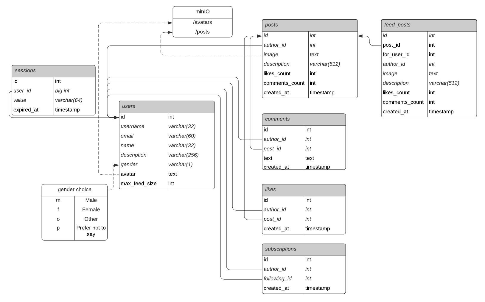

# 1. Выбор темы
Аналог Instagram, направленный на российскую аудиторию. MVP - личный профиль, подписки, лента, комментарии и лайки

# 2. Расчет нагрузки

## 2.1. Аудитория и ее активность

Месячная аудитория Instagram в России на 2021 год составляет 54 млн [(источник)](https://blog.hootsuite.com/instagram-demographics/)  
Дневная аудитория ~30 млн

На 2021 год в среднем, пользователь тратит 29 минут в день [(источник)](https://www.emarketer.com/content/emarketer-reduces-us-time-spent-estimates-for-facebook-and-snapchat)  
## 2.2. Собственные наблюдения
За 3 минуты просмотра ленты я успел просмотреть 30 постов, поставить 5 лайков и оставить один комментарий  

Будем предполагать, что средний пользователь добавляет 15 фотографий в свой профиль за месяц. Взаимодействует с подписками 10 раз в месяц  

## 2.3. Активность на пользователя

### Картинки
Картинки загружаются отдельными запросами на каждый пост. Причем на каждый пост приходится две картинки - аватар автора и сам пост.
```
60 GET / 3 min
```

### Post:
За один запрос на посты приходит 12 штук
```3 GET / 3 min``` Количество лайков, комментариев и сами первые три комментарии приходят вместе с запросом  
```15 POST / month``` Запрос на один пост занимает примерно 200кб (картинка) + 5 кб (другая информация)  

### Profile:
```1 GET / 3min``` Вместе с запросом на профиль приходит информация о подписках.  

Запрос на профиль занимает 40кб + первые посты ~740кб  

### Comment:
```
1 POST / 3 min.
5 GET / 3 min
```

Средняя длина комментариев в социальных сетях 200 символов (200b) [(источник)](https://habr.com/ru/post/72185/)  

### Subscriptions:
```
10 POST / month
```

### Likes:
```
5 POST / 3 min
```

## 2.4. Нагрузка от всей аудитории
Подитожим за сутки, учитывая, что пользователь тратит в сутки в среднем 29 мин:  

Пусть ```k = 30 000 000 users / (24 * 60 * 60) = 347,22 u/s``` - коэффициент, переводящий показатель requests per day для одного человека в rps для всей аудитории. 

### Получение картинок:
Средний вес картинки 200 Кб, аватарки - 4 Кб
```
60 * (29 min / 3 min) * k= 580 requests / day * k = 201 389 rps (19,59 Gb/s)
```

### Post
	GET: 3 * (29 min / 3 min) * k = 29 requests/day * k = 10 069 rps  (19,69 Gb/s)
	POST: 15 / 30 days * k = 0,5 requests/day * k = 174 rps (34,62 Mb/s)
### Profile
	GET: 1 * (29 min / 3 min) * k = 10 requests/day * k = 3 472 rps (32,78 Mb/s)

Прирост месячной аудитории в России за 2021 год согласно [источнику](https://blog.hootsuite.com/instagram-demographics/) составляет 3 млн пользователей.

Это значит, прирост пользователей в день ```3 million / 365 = 8219,14 users/day```  

Тогда rps на post profile будет ~ 1 rps  

### Comments:
За один запрос на комментарии приходит 12 комментариев. Один ответ весит в среднем 4 Kb (with gzip) -> 8kb (without gzip) -> avg comment response size = 8 / 12 = 0,67 Kb
```
GET 5 * 29 min / 3 min * k = 16 782 rps (65,56 Mb/s) (with gzip)
POST 1 * 29 min / 3 min * k = 3 356 rps (2,2 Mb/s) (without gzip)
```

### Likes:
```
POST 5 * 29 min / 3 min * k = 16 782 rps
```

### Subscriptions:
```
POST: 10 * 1 month / 30 days * k = 115 rps
```
Итого:
|Сущность|GET RPS|POST RPS|
|--------|-------|--------|
|Картинки|201 389|175|
|Post|10 069|174|
|Profile|3 472|1|
|Comment|16 782|3 356|
|Subscription|-|115|
|Like|-|16 782|
# 3. База данных
## 3.1. Логическая схема БД

## 3.2. Физическая схема БД
### 3.2.1. Фотографии
Все фотографии будем хранить в S3. В качестве S3 выберем решение от min.io.
В качестве S3 будем использовать решение minio  
Картинки постов будут храниться по пути /posts/{user_id}/{image_hash}.jpg
Аватарки - /avatars/{user_id}.jpg
#### Посты
При загрузке постов фотографии будут сжиматься до максимального размера ~700 Кб.  
Чаще всего встречающиеся размеры фотографий в Instagram: (720x1280, 1280x1350, 1080x1080, 720x720, 1080x695). Максимальный вес встретившейся фотографии - 623 кб. В среднем фотографии весят 200 кб  
Также будем хранить копию в размере 480x480 для отображения сетки профиля. Примерный вес такого изображения - 40 кб
#### Аватарки
Аватарки будут храниться в размере 150x150. В среднем вес аватраки - 5 кб  
### 3.2.2. Выбор СУБД
Данные пользователей, посты и комментарии будем хранить в PostgreSQL, как в наиболее надежной и функциональной реляционной БД.  
Данные сессии, лайки и подписки будем хранить в Tarantool из-за его выскокой скорости работы 
### 3.2.3. Шардирование и репликация
|Сущность|Признак шардирования|
|--------|--------------------|
|sessions |value|
|users    |id|
|posts|author_id|
|comments|post_id|
|likes|post_id|
|subscriptions|author_id|
|images|user_id|

Для обеспечения отказоустойчивости используем master-slave репликацию. По 2 реплики на каждый сервер. Мастер будет принимать запросы на запись, реплики - на чтение. При выходе из строя мастера, одна из реплик возмет на себя запросы на изменение. При выходе из строя всех реплик, запросы будут приходить только на мастер.
## 3.3. Размер данных
### Фотографии
Аватарки на всех пользователей
```
avatars = 54 000 000 * 5 kb = 257,49 Gb
avatars_speed = 5 kb * 1 rps * 24h * 60m * 60s = 0,5 Tb/month
posts_speed = 240 kb * 174 rps * 24h * 60m * 60s = 3,36 Tb/day = 100,81Tb/month
overall = 101,3 TB/month
```
### Сессии
Учитываем активную дневную аудиторию, т.к. у пользователей которые долго не заходят сессии пропадают
```
(4b (id) + 4b (user_id) + 64b (value) + 4b (expired_at)) * 30 000 000 = 2,12 Gb
```
### Пользователи
Учитываем месячную аудиторию
```
(4b (id) + 32b (username) + 60b (email) + 32b (name) + 256b (description) + 1b (gender) + ~120b (avatar url)) * 54 000 000 000 = 25,4 Gb

1rps * 24 * 60 * 60 = 41,61 Mb/day = 1,22 Gb/month
```
### Посты
```
(4b (id) + 4b (author_id) + ~120b (image url) + 512b (description) + 4 (likes_count) + 4 (comments_count) + 4 (created_at)) * 174 rps * 24h * 60m * 60s = 9,13 Gb/day = 273,86 Gb/month
```
### Комментарии
В среднем у постов 4 комментариев [(источник)](https://blog.cybermarketing.ru/vovlechennost-instagram/)
```
(4b (id) + 4b (author_id) + 4b (post_id) + 200b (text) * 4b (created_at)) * 4 * 174 rps * 24 * 60 * 60 = 12 Gb/day = 362,9 Gb/month
```
### Лайки
В среднем у поста 100 лайков [(источник)](https://blog.cybermarketing.ru/vovlechennost-instagram/)
```
(4b (id) + 4b (author_id) + 4b (post_id)) * 100 * 174 * 24 * 60 * 60 = 16,8 Gb/day = 504,04 Gb/month
```
### Подписки
```
(4b (id) + 4b (author_id) + 4b (following_id)) * 115 * 24 * 60 * 60 = 113,71 Mb/day = 3,33 Gb/month
```
|Сущность|Размер|
|---|---|
|Фотографии|0,25 Tb + 101,3 Tb/month|
|Сессии|2,12 Gb|
|Пользователи|25,4Gb + 1,22 Gb/month|
|Посты|273,86 Gb/month|
|Комментарии|362,9 Gb/month|
|Лайки|504,04 Gb/month|
|Подписки|3,33 Gb/month|
# 4. Схема проекта
Проект будем строить по микросервесной архитектуре, в силу простой масштабируемости отдельных компонентов системы.
Выделим следующие микросервисы:
1. API - сервис, который принимает запросы от клиента и решает, с какого сервиса какие данные запросить
2. Авторизация - сервис, который отвечает за авторизацию, понимание, авторизован ли пользователь (по кукам), и что это за пользоватеь
3. Профиль - отвечает за сбор регистрацию, получение страницы профиля
4. Посты - отвечает за ленту, посты пользователя
5. Подписки - создание, получение подписок, удаление подписки, счетчик общего количества подписок для пользователя
6. Комменты - создание, поллучение комментариев для поста
7. Лайки - создание, получение, удаление

К каждому микросервису прикреплена своя база данных (за исключением агрегирующего сервиса API)


## 4.1. Выбор технологий
### Backend
Микросервисы будем реализовывать на языке Golang в силу очень хорошего соотношения по производительность и легкости разработки. Так же будет очень кстати встроенная в язык работа с многопоточностью

### Client
Проект будет разрабатываться только под мобильные устройства. Для iOS будем разрабатывать на Swift, для Android - Kotlin.
# 5. Выбор оборудования
## 5.1. Расчет RPS на каждый микросервис
Пройдемся по каждому запросу и обозначим, как он будет происходить, какие сервисы затрагивать.
### Посты
1. Запрос на получение ленты (10 069 rps):
- API
- Auth - проверка авторизации, понимание, какой пользователь спрашивает
- Subscriptions - получение информации о том, на кого подписан пользователь
- Posts - получение последних постов пользователей, на которых подписан пользователь, формирование ленты
- Comments - получение последних трех комментариев для постов
2. Создание поста (174 rps): 
- API
- Auth
- Posts - создание поста
- S3 - загрузка фотографии в хранилище
### Профиль
1. Получение профиля пользователя (3 472 rps):
- API
- Profile - получение основной информации пользователя (имя, логин, урл картинки, bio)
- Subscriptions - получение информации о подписках
- Posts - количество постов, получение первых в пагинации постов
- Comments
2. Создание профиля (1 rps):
- API
- Profile - создание пользователя
- Auth - выдача сессии
### Комментарии
1. Получение комментариев к посту (16 782 rps):
- API
- Comments - получение комментариев к посту
2. Отправка комментария (3 356 rps):
- API
- Auth
- Comments - cоздание комментария
- Posts - увеличение счетчика комментариев у поста
### Подписки
1. Добавление/удаление подписки (115 rps):
- API
- Auth
- Subscriptions
### Лайки
1. Лайк поста (16 782 rps):
- API
- Auth
- Likes - создание записи лайка
- Posts - увеличение счетчика у поста
### Итого
|Микросервис\Запрос|Посты GET|Посты POST|Профиль GET|Профиль POST|Комментарии GET|Комментарии POST|Подписки|Лайки |Сумма на чтение |Сумма на запись|
|---		   |---	     |---	|---	    |---	 |---	         |--		  |---	   |---	  | ---            |---	      	   |
|API		   |10 069   |174	|3 472	    |1		 |16 782	 |3 356	          |115	   |16 782|50 751 	   |-              |
|Auth		   |10 069   |174	|-	    |1		 |-		 |3 356		  |115	   |16 782|30 497	   |1    	   |
|Posts		   |10 069   |174	|3 472	    |-		 |-		 |3 356	          |-	   |16 782|13 541 	   |20 312         |
|Profile	   |-	     |-		|3 472	    |1		 |-		 |-	          |-	   |-	  |3 473 	   |1		   |
|Comments	   |10 069   |-		|3 472	    |-		 |16 782	 |3 356	          |-	   |-	  |30 323	   |3 356          |
|Likes		   |-	     |-		|-	    |-		 |-		 |-	          |-	   |16 782|-		   |33 564         |
|Subscriptions	   |10 069   |-		|3 472	    |-		 |-		 |-	          |115	   |-	  |13 541	   |115	           |
## 5.2. Расчет оборудования
При расчете будет учитываться пиковое значение RPS (2x от среднего рассчитанного)
Для расчета оборудования сервисов с Tarantool будем исходить из расчетов по [калькулятору](https://www.tarantool.io/en/sizing_calculator/)
Для расчета оборудования сервисов с PostgreSQL будем опираться на [статью](https://habr.com/ru/company/avito/blog/525294/) ребят из Avito

### API
CPU: 32 core  
RAM: 32 Gb
### Auth
Из расчета, что сессии на дневную аудиторию будем хранить в памяти, нам понадобится следующие ресурсы  
CPU: 21 core  
RAM: 3 Gb
  
Делим на два шарда  
CPU: 16 core  
RAM: 8 Gb  
\+ 4 реплики (по 2 на каждый шард)  

### Posts
Сотрудникам Avito удалось добиться оптимизации взаимодействия Golang приложения с базой PostgreSQL с серьезным запросом на серьезных объемах данных приблезительно равным нашим в 5000 rps на 4 CPU и 16GB RAM.  
Исходя из этих соображений будем считать, что для обеспечения 40 624 rps нам будет достаточно 32 cpu 128 RAM  
RPS выбрали максимальный без суммирования потому что чтение будет производиться с реплик, а запись на мастер  
Делим на 3 шарда  
CPU: 16 core  
RAM: 64 RAM  
SSD: 2 Tb  
\+ 6 реплики (по две на каждую)  

### Profile
Согласно описанному выше  
Делим на 2 шарда  
CPU: 8 core  
RAM: 16 Gb  
SSD: 256 Gb
\+ 2 репликии  

### Comments
Храним в Tarantool. Комментарии за день будем хранить в памяти. Это примерно 60 млн записей  
Делим на 2 шарда  
CPU: 16 core  
RAM: 32 Gb  
SSD: 2Tb Gb  
\+ 4 реплики (по 2 на каждый шард)  

### Likes
Если будем в памяти хранить 100 000 000 записей нам хватит
Делим на 2 шарда
CPU: 16 core
RAM: 32 Gb
SSD: 2Tb Gb
Шардируем на 2 узла
\+ 4 реплики (по 2 на каждый шард)

### Subscriptions
Все будем хранить на диске
Шардируем на 2 узла
CPU: 8 core
RAM: 16 Gb
SSD: 128 Gb
\+ 4 реплики (по 2 на каждый шард)

### Изображения
Изображения нам нужно отдавать со скоростью ~ 40 Gb/s в пиковые нагрузки. Нам подойдет конфугирация из приводимого в [тестах banchmark minio](https://blog.min.io/scaling-minio-more-hardware-for-higher-scale/) сервер, состоящий из 32 узлов, каждый с 8 NVMe кластерами. Каждый кластер содержит 8 ТБ SSD. В итоге получается 2 Pb
### Итого
|Сервис|CPU(cores)|RAM(Gb)|SSD (Gb)|Количество (репликации)|
|---   |---	  |---	  |---	   |---	  		   |
|API   |32(2x16)  |32	  |min	   |1 (+1)		   |
|Auth  |16(2x8)	  |16	  |min	   |2 (+4)		   |
|Posts |16(2x8)	  |64	  |2048	   |3 (+6)		   |
|Profile|8(2x4)	  |16	  |256	   |2 (+4)		   |
|Comments|16(2x8) |32	  |2048	   |2 (+4)		   |
|Likes |16(2x8)	  |32	  |2048	   |2 (+4)		   |
|Subscriptions|8(2x4)|16  |128     |2 (+4)                 |
|Изображения|16   |16     |64Tb(8x8Tb)|32 (+64)            |

### Балансировщик нагрузки
За входящий трафик с клиентов отвечают инстансы Nginx'а с L7 схемой.

- Алгоритм балансировки кэширующих прокси: Условный round-robin нам не подойдет, т.к. для обеспечения высокого попадания в кэш запрос за одной и той же фотографией всегда должен приходить на один и тот же прокси. Будем выбирать прокси по хэшу запрашиваемого URL, для обеспечения нормального горизонтального масштабирования будем использовать [Consistent hashing] (https://en.wikipedia.org/wiki/Consistent_hashing)

- продуктовые бэкенды могут балансироваться при помощи round-robin, т.к. для клиентов нет разницы в какой продуктовый бэкенд ходить

# 6. Расположение сервера
Так как основная частью аудитории живет в западной части России, то сервера будут располагаться в подмосковье. Причем каждый из серверов из тройки master-slave-slave должны располагаться в разных датацентрах. Балансировщики в разных двух датацентрах
# 7. Отказоустойчивость
Так как сервера распределены по 3-м разным датацентрам, то неисправность в однои из них не приведут к полному прерыванию работы всего сервиса.

При неполадках в конкретных серверах сервис останется доступным:

- Если API - сервис вышел из строя, то балансировщики перестанут перенаправлять к нему запросы, будет использован запасной.
- Если один из балансировщиков отказал, то в рамках того же белого ip-адреса будет отвечать другой балансировщик - резервирование балансировщиков с сохранением белого ip-адреса (Common Address Redundancy Protocol (CARP))
- Если master выйдет из строя, его заменит slave, кластер сменит конфигурацию, после чего запросы на запись будут приходить вновь объявленному master - сервис останется доступным.
- Если slave выйдет из строя, то есть ещё один slave, который начнет принимать все запросы на чтание - сервис останется доступным.
